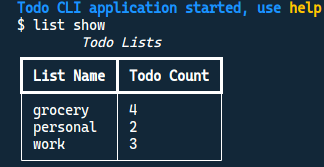
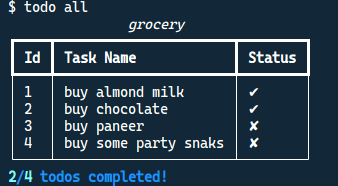

<div align="center">
<h1 align="center">Todo CLI</h1>
<br><br>
A simple to-do list application that can be accessed via a Command-Line Interface (CLI), application allow users to add, remove, edit, and list tasks in a convenient and efficient manner.<br><br>
</div>

---
## Visuals
Show all todo lists | List all todo's
:-------------------------:|:-------------------------:
 | 

## Features

- Create a todo list
- Show all the todo lists
- Add, edit, delete, mark as complete, incomplete the todo items present in those lists
- Show all the todo items in a particular list
- Todo's completion data insights

## Commands to use the CLI app

prefixes for the commands: `list`, `todo`

- `list show` -> show all the todo lists
- `list create list_name` -> create a list with list_name
- `list use list_name` -> start using a particular list
- `list drop list_name` -> remove a particular list
- `todo add todo_title` -> add a todo item in the selected list
- `todo all` -> show all todos in the selected list
- `todo edit item_id new_title` -> edit the todo item with id=item_id
- `todo remove item_id` -> remove the todo item with id=item_id
- `todo complete item_id` -> mark a todo item with id=item_id as complete
- `todo incomplete item_id` -> mark a todo item with id=item_id as incomplete
- `help` -> print all the commands provided by the app
- `quit` or `exit` -> exit the application

## JSON schema

- Schema for storing all the todo lists

```JSON
{
  "list1": {
    "file_name": "list1.json",
    "created_at": "timestamp"
  }
}
```
- Schema for storing todo's in a todo list
```JSON
[
  {
    "title": "todo_title1",
    "completed": false,
    "created_at": "timestamp"
  },
  {
    "title": "todo_title2",
    "completed": true,
    "created_at": "timestamp"
  }
]
```

## Usage instructions
```bash
# clone the repo & navigate to the root directory that contains the Pipfile
git clone https://github.com/ashleymavericks/todo-cli.git && cd todo-cli

# Install dependencies & create a virutal environment using pipenv
pipenv install

# Activate the virtual environment
pipenv shell

# Run the application
python app.py
```